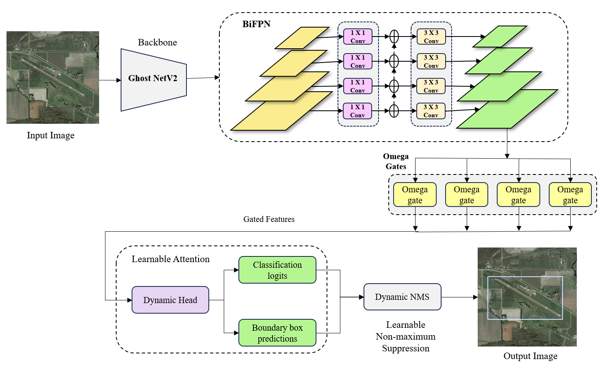

# EdgeNet: A Compact Model for Real-Time Airport Detection on Edge Devices

A state-of-the-art object detection model designed for real-time airport and runway detection on resource-constrained edge devices. EdgeNet combines efficiency with sophisticated deep learning techniques including Dynamic Head, Dynamic NMS, and Bi-directional Feature Pyramid Networks.

##  Key Features

- **Edge-Optimized Architecture**: Built on GhostNetV2 backbone for efficient inference (~45ms on Tesla T4)
- **Dynamic Components**: Adaptive prediction heads and learnable NMS for superior performance
- **Multi-Scale Detection**: BiFPN with Omega gates for handling scale variations in aerial imagery
- **Real-Time Performance**: Achieves 22.17 FPS with 1.08 detections per image
- **High Accuracy**: mAP@0.5 of 0.904 and overall mAP of 0.825

##  Performance Metrics

### Final Evaluation Results

| Metric | Score |
|--------|-------|
| **mAP** | **0.825** |
| **mAP@0.5** | **0.904** |
| **mAP@0.75** | **0.743** |
| **AR@100** | **0.858** |
| **map_small** | **0.758** |
| **map_medium** | **0.777** |
| **map_large** | **0.901** |

### Edge Deployment Metrics

| Metric | Value |
|--------|-------|
| **Device** | Single Tesla T4 |
| **Mean Inference Time** | 45.11 ms |
| **Frames Per Second (FPS)** | 22.17 |
| **Throughput** | 22.17 img/sec |
| **Detections per Image** | 1.08 |
| **GPU Memory Usage** | ~41.45 MB (peak) |

## Architecture

EdgeNet features a sophisticated multi-component architecture:




### Core Components

#### 1. **Dynamic Head Module**
- Generates prediction-specific weights dynamically based on input features
- Separate weight networks for classification and regression
- Level-specific attention mechanism for multi-scale processing
- Content-adaptive processing for varying environmental conditions

#### 2. **Dynamic NMS**
- Learnable IoU threshold (differentiable through sigmoid)
- Class-specific score weighting for balanced detection
- End-to-end optimization with the detection pipeline
- Automatic hyperparameter tuning during training

#### 3. **Omega Gates (Ω-Gates)**
- Feature-level attention for each pyramid level
- Learned "volume knobs" for channel-wise feature modulation
- Scale-aware processing for different object sizes
- Minimal parameter overhead (~66K parameters)

#### 4. **BiFPN (Bi-directional Feature Pyramid Network)**
- Efficient multi-scale feature fusion
- Top-down and bottom-up information flow
- Lateral connections with smooth operations
- Unified 128-channel representation

## Installation

### Prerequisites
- Python 3.8+
- CUDA 11.0+ (for GPU acceleration)
- 8GB+ RAM (16GB recommended)

### Setup

1. **Clone the repository**
```bash
git clone https://github.com/Bhargavmupparisetty/EdgeNet.git
cd EdgeNet
```

2. **Install dependencies**

packages are auto installed on running the script:
```python
python inference.py
```

This will:
1. Load the trained model from `models/airport_detection.pt`
2. Run inference on the validation dataset
3. Generate two visualization panels:
   - **Panel 1**: 12 sample predictions with bounding boxes
     - Red/Orange boxes: Predictions (colored by confidence)
     - Green boxes: Ground truth
   - **Panel 2**: Performance analytics
     - Confidence distribution histogram
     - Box area distribution
     - Predictions per image
     - Validation metrics bar chart
     - Confidence vs. area scatter plot
     - Performance summary statistics

### Required Packages
- `torch >= 2.0.0`
- `timm >= 0.9.0` (for GhostNetV2 backbone)
- `opencv-python >= 4.8.0`
- `matplotlib >= 3.7.0`
- `seaborn >= 0.12.0`


## Dataset Structure

EdgeNet expects data in YOLO format:

```
sample_dataset/
├── images/
│   ├── train/
│   │   ├── image1.jpg
│   │   ├── image2.jpg
│   │   └── ...
│   └── val/
│       ├── image1.jpg
│       └── ...
└── labels/
    ├── train/
    │   ├── image1.txt
    │   ├── image2.txt
    │   └── ...
    └── val/
        ├── image1.txt
        └── ...
```


##  Evaluation Metrics

The model is evaluated using COCO-style metrics:

- **mAP**: Mean Average Precision across IoU thresholds [0.5:0.95]
- **mAP@0.5**: AP at IoU threshold 0.5 (primary metric)
- **mAP@0.75**: AP at IoU threshold 0.75 (strict metric)
- **AR@100**: Average Recall with max 100 detections
- **map_small/medium/large**: AP for different object scales

  The evaluation metrics of the model are shown in figure below:
  

## License

This project is licensed under the MIT License - see the [LICENSE](LICENSE) file for details.

## Dataset

A curated dataset of airports accross Indian subcontinent is collected from Google Earth Pro.

The *Airport Dataset* used in this work is available on Kaggle:  
[https://doi.org/10.34740/kaggle/ds/6757673](https://doi.org/10.34740/kaggle/ds/6757673)  

Please cite the dataset if used in your project.


## Citation

If you use EdgeNet in your research, please cite:

```bibtex
@software{edgenet2025,
  title={EdgeNet: A Compact Model for Real-Time Airport Detection on Edge Devices},
  author={Bhargav Mupparisetty},
  year={2025},
  url={https://github.com/Bhargavmupparisetty/EdgeNet}
}
```

